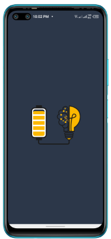
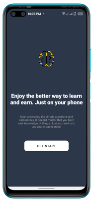
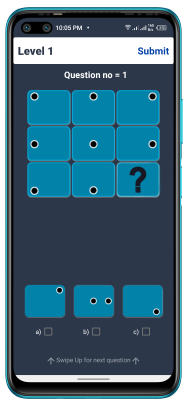

# Android APP Brain Fusion


## Overview

Project Brain Fusion is an interactive IQ-level test game for Android that challenges users with thought-provoking quizzes. Test your cognitive abilities and unlock new levels by answering a series of questions. Are you ready to fuse your brainpower?

## Features

- **Quiz Levels:** Engage in brain-teasing quizzes organized into levels.
- **Challenge Yourself:** Each level consists of 9 questions. You must correctly answer at least 6 questions to unlock the next level.
- **Interactive Interface:** Enjoy a user-friendly and interactive interface for a seamless gaming experience.

## Screenshots

   

## Getting Started

Follow these steps to get started with Brain Fusion on your Android device:

1. **Clone the repository:**
    ```bash
    git clone https://github.com/devv-abubakar/Brain-Fusion.git
    ```

2. **Open the project in Android Studio.**
   - Ensure you have the latest version of Android Studio installed.

3. **Build and run the app on your emulator or device.**

## How to Play

1. Launch the app on your Android device.
2. Navigate through levels by successfully answering at least 6 out of 9 questions.
3. Challenge your friends and see who can reach the highest level!

## Contributing

If you would like to contribute to Brain Fusion, please follow our [contribution guidelines](CONTRIBUTING.md).

## License

This project is licensed under the [MIT License](LICENSE).
